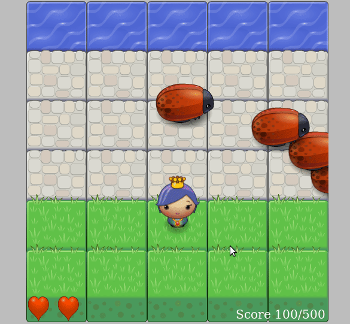
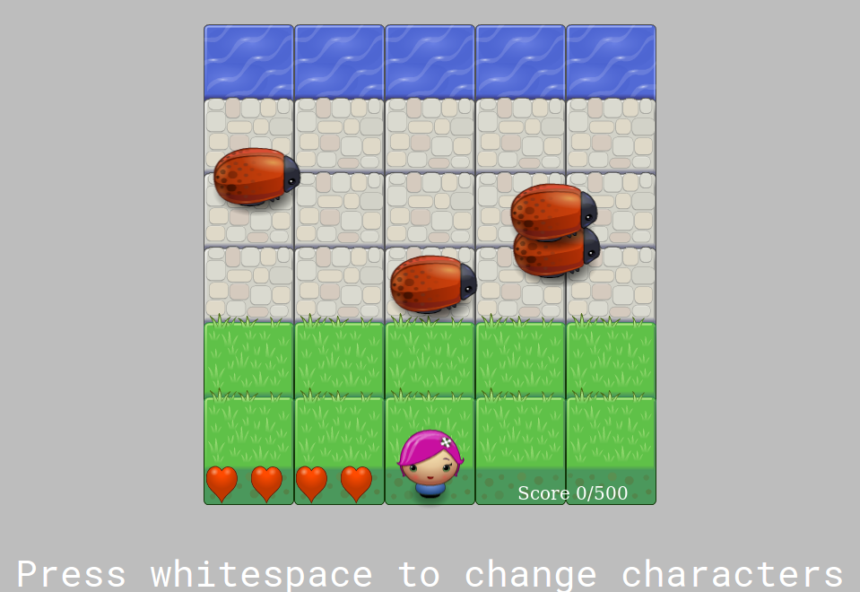
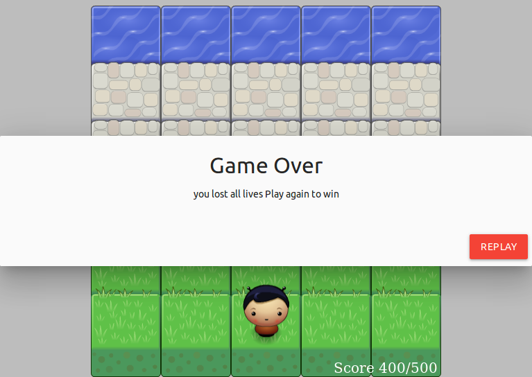

#  Arcade Game 🎮 🎮  

## Table of Contents
- [HowTostartPlay](#startPlay)
- [Instructions](#instructions)
- [Screenshot](#screenshot)
## StartPlay
**You can play in your machine by double click of index.html OR you can play [over here](https://abdulrahmanabdullah.github.io/arcade-game/index.html)**
## Instructions
- Move vhicle to reach the water area :potable_water: 🚰 
- Use keyboard arrows the move move vhicle:
    - ⬅️ ➡️ ⬆️ ⬇️
- Press whitespace to change vhicles 🔃

## Features 
*We add some features like sounds 🔉 when player win 👍 or lose 👎 or vhicle crash with bugs 🐛,*
*Add Toast message when player get some score 🙃,*
*Up game level when player get more 300 score,*
*Materailzing library ❤️ ❤️*

## Screenshot

